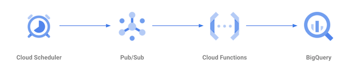

# Schedule queries for BigQuery

To schedule recurring queries in BigQuery, for example to create ELT processes, a number of methods can be used. Here are some of them.

## *Scheduled Queries* module in BigQuery

In the BiqQuery interface, enter a query and click the *Schedule query* button and *Create new scheduled query* (you may be required to activate the BigQuery Data Transfer API).  

You will be requested to enter a name, a schedule, a destination for your query results if applicable, as well as optional notification settings.

Once set up, you can manage your scheduled queries in the *Scheduled queries* module.

## Command-line tool and cron job

You can also use the `bq` commande line tool (see [documentation](https://cloud.google.com/bigquery/docs/quickstarts/quickstart-command-line)). For example, the following query can be saved in an executable file named `query.sh`:  

```sh
bq query --nouse_legacy_sql \
'SELECT * FROM `dataset.table` LIMIT 10'
```

and then scheduled with a cron job:  

```sh
00 03 * * * /home/me/query.sh
```

## Cloud Functions + Cloud Scheduler

For more advanced capabilities, you can use the [BigQuery API](https://cloud.google.com/bigquery/docs/quickstarts/quickstart-client-libraries). An example of queries run through the API can be found on [this project](../workbook/search_reporting).

Once you have a script, you can wrap it in a [Google Cloud Function](https://cloud.google.com/functions/docs/quickstarts), and set a recurring schedule with [Cloud Scheduler](https://cloud.google.com/scheduler/docs/quickstart) to trigger your function via a [Pub/Sub](https://cloud.google.com/pubsub/docs/quickstarts) message.


