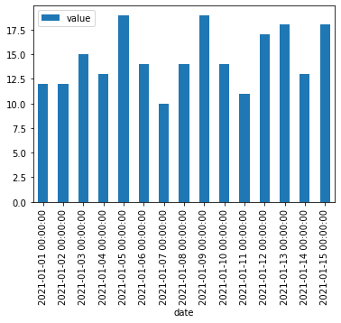
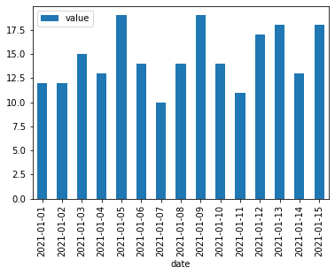
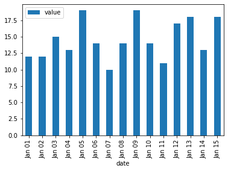

# Format dates in pandas bar plot

When using dates as axis labels of a pandas barplot (`plot.bar()`), dates are rendered with time as well, e.g. `2021-01-01 00:00:00`.

Below are two methods to display the date with a more suitable format.

```python
# Import libraries
import pandas as pd
from numpy.random import randint

# Create sample data
df = pd.DataFrame({'date':pd.date_range(start='01/01/2021', periods=15), 
                   'value':randint(10, 20, 15)})

# Default plot with full datetime
df.plot.bar(x='date');
```

    

    

## Keep only the date part with `dt.date`

```python
# Keep only the date
df.assign(date=lambda x: x['date'].dt.date).plot.bar(x='date');
```

    

    

## More control with `dt.strftime`

```python
# Format date with strftime
df.assign(date=lambda x: x['date'].dt.strftime('%b %d')).plot.bar(x='date');
```

    

    

