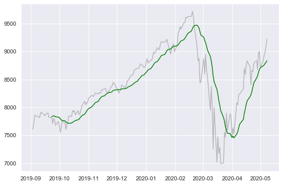
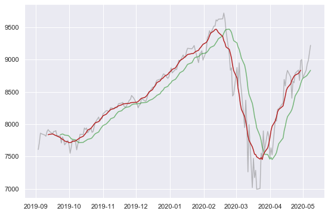

# Pandas: calculate moving averages and rolling windows

## Setup

```python
# Import libraries
import pandas as pd
import seaborn as sns

%matplotlib inline
sns.set(rc={'figure.figsize':(9,6)})
```

```python
# Read sample data with date index
df = pd.read_csv('data/finance_data.csv', parse_dates=['Date'])
df = df.set_index('Date')['2019-09':].loc[lambda x: x['Name'] == 'Nasdaq100', 'Value']
df
```

    Date
    2019-09-03    7609.51
    2019-09-04    7719.25
    2019-09-05    7862.54
    2019-09-06    7852.54
    2019-09-09    7832.40
                   ...   
    2020-05-04    8834.11
    2020-05-05    8930.62
    2020-05-06    8984.86
    2020-05-07    9101.88
    2020-05-08    9220.35
    Name: Value, Length: 173, dtype: float64

## Moving averages

```python
# Moving average over the last 15 days
mavg = df.rolling(15).mean()

# Plot result
sns.lineplot(data=df, alpha=0.5, color='grey')
sns.lineplot(data=mavg, color='green');
```

    

    

```python
# Centered moving average
mavg_ctd = df.rolling(15, center=True).mean()

# Plot result
sns.lineplot(data=df, alpha=0.5, color='grey')
sns.lineplot(data=mavg, alpha=0.5, color='green')
sns.lineplot(data=mavg_ctd, color='firebrick');
```

    

    

## Rolling windows for any calculation

While moving averages are useful for time series, `rolling()` can be associated with a number of other calculations, like sum, count, min or max, etc.

```python
df.rolling(5).sum()
```

    Date
    2019-09-03         NaN
    2019-09-04         NaN
    2019-09-05         NaN
    2019-09-06         NaN
    2019-09-09    38876.24
                    ...   
    2020-05-04    44213.16
    2020-05-05    44466.18
    2020-05-06    44468.28
    2020-05-07    44569.65
    2020-05-08    45071.82
    Name: Value, Length: 173, dtype: float64

```python
df.rolling(5).count()
```

    Date
    2019-09-03    1.0
    2019-09-04    2.0
    2019-09-05    3.0
    2019-09-06    4.0
    2019-09-09    5.0
                 ... 
    2020-05-04    5.0
    2020-05-05    5.0
    2020-05-06    5.0
    2020-05-07    5.0
    2020-05-08    5.0
    Name: Value, Length: 173, dtype: float64

```python
df.rolling(5).min()
```

    Date
    2019-09-03        NaN
    2019-09-04        NaN
    2019-09-05        NaN
    2019-09-06        NaN
    2019-09-09    7609.51
                   ...   
    2020-05-04    8677.60
    2020-05-05    8718.18
    2020-05-06    8718.18
    2020-05-07    8718.18
    2020-05-08    8834.11
    Name: Value, Length: 173, dtype: float64

