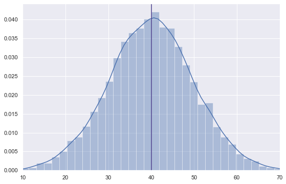
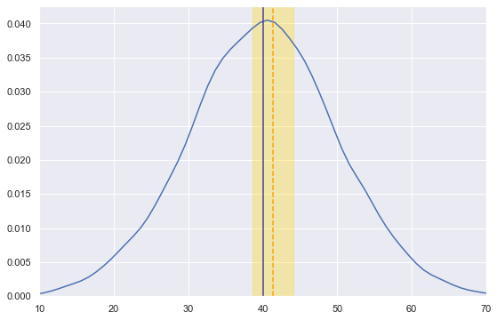

# Confidence intervals in Python

## Setup

```python
# Import libraries
import numpy as np
import pandas as pd
import seaborn as sns
import matplotlib.pyplot as plt

%matplotlib inline
sns.set(rc={'figure.figsize':(9,6)})
```

## Generate population data

```python
# Generate normal distributed data
np.random.seed(222)
df = pd.DataFrame({'value': np.random.normal(loc=40, scale=10, size=10000)})

# Plot histogram and mean (in green)
sns.distplot(df);
plt.xlim(10, 70)
plt.axvline(df.mean()[0], color='darkslateblue');
```

    

    

```python
# Check actual mean and standard deviation
df.describe().head(3)
```

<div>

<table border="1" class="dataframe">
  <thead>
    <tr style="text-align: right;">
      <th></th>
      <th>value</th>
    </tr>
  </thead>
  <tbody>
    <tr>
      <th>count</th>
      <td>10000.000000</td>
    </tr>
    <tr>
      <th>mean</th>
      <td>40.015843</td>
    </tr>
    <tr>
      <th>std</th>
      <td>9.936291</td>
    </tr>
  </tbody>
</table>
</div>

## Generate sample 

```python
# Random sample
sample_df = pd.DataFrame(np.random.choice(df['value'], 50))

# Plot sample distribution
sample_df.describe().head(3)
```

<div>

<table border="1" class="dataframe">
  <thead>
    <tr style="text-align: right;">
      <th></th>
      <th>0</th>
    </tr>
  </thead>
  <tbody>
    <tr>
      <th>count</th>
      <td>50.000000</td>
    </tr>
    <tr>
      <th>mean</th>
      <td>41.321748</td>
    </tr>
    <tr>
      <th>std</th>
      <td>9.948352</td>
    </tr>
  </tbody>
</table>
</div>

## Calculate confidence interval

The confidence interval formula is:
$$\bar{x}\pm z*\frac{\sigma}{\sqrt{n}}$$

where:  
$\bar{x}$ is the sample mean  
$z$ is the [z-score](https://en.wikipedia.org/wiki/Standard_score)  
$\sigma$ is the sample standard deviation  
$n$ is the sample size  

```python
# Calculate confidence interval
x_bar = sample_df.mean()[0] # Sample mean
sigma = sample_df.std()[0]  # Standard deviation
n = len(sample_df)          # Sample size
z_score = 1.96              # Z-score for 95% two-sided interval

ci = [x_bar - z_score * sigma / np.sqrt(n), x_bar + z_score * sigma / np.sqrt(n)]
ci
```

    [38.564205758105565, 44.07929074221945]

```python
# Plot histogram and true population mean
sns.distplot(df, hist=False);
plt.xlim(10, 70)
plt.axvline(df.mean()[0], color='darkslateblue')

# Plot sample mean and confidence interval
plt.axvline(x_bar, color='orange', linestyle='--')
plt.axvspan(ci[0], ci[1], alpha=0.3, color='gold');
```

    

    

The plot above shows the population actual distribution with a mean of 40.01, as well as the sample mean (41.32) and a 95% confidence interval of [38.56, 44.08].
