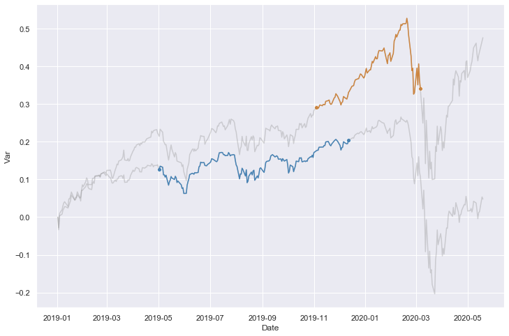
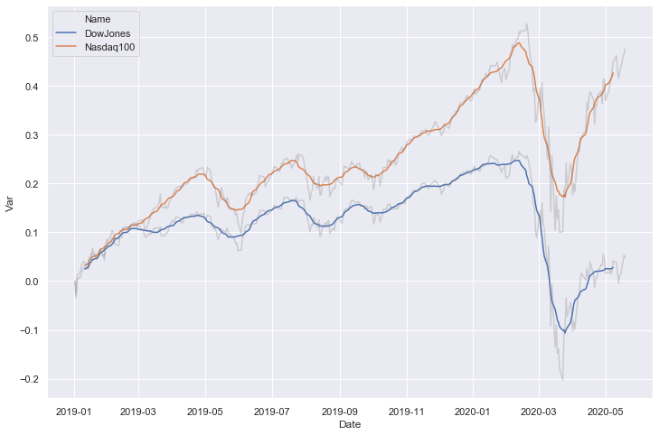

# Plot time series with Python seaborn

## Setup

```python
# Import libraries
import pandas as pd
import seaborn as sns

%matplotlib inline
sns.set(rc={'figure.figsize':(12,8)})
```

```python
# Read sample data, parsing date field
df = pd.read_csv('data/finance_data.csv', parse_dates=['Date'])
df.tail()
```

<div>

<table border="1" class="dataframe">
  <thead>
    <tr style="text-align: right;">
      <th></th>
      <th>Name</th>
      <th>Date</th>
      <th>Value</th>
    </tr>
  </thead>
  <tbody>
    <tr>
      <th>691</th>
      <td>Nasdaq100</td>
      <td>2020-05-13</td>
      <td>9000.08</td>
    </tr>
    <tr>
      <th>692</th>
      <td>Nasdaq100</td>
      <td>2020-05-14</td>
      <td>9094.42</td>
    </tr>
    <tr>
      <th>693</th>
      <td>Nasdaq100</td>
      <td>2020-05-15</td>
      <td>9152.64</td>
    </tr>
    <tr>
      <th>694</th>
      <td>Nasdaq100</td>
      <td>2020-05-18</td>
      <td>9331.93</td>
    </tr>
    <tr>
      <th>695</th>
      <td>Nasdaq100</td>
      <td>2020-05-19</td>
      <td>9390.94</td>
    </tr>
  </tbody>
</table>
</div>

This dataset contains daily values for the Nasdaq 100 and Dow Jones indices, between 01/01/2019 and 19/05/2020. Which was quite an interesting period.

## Plot relative variation with emphasis on specific periods

```python
# Normalize values to the first date
df['Var'] = (
    df
    .groupby('Name')
    .apply(lambda x: x['Value']/(x.head(1)['Value'].values))
    .values-1
)
```

```python
# Plot all values
sns.lineplot(data=df, x='Date', y='Var', units='Name', estimator=None, color='grey', alpha=0.3)

# Plot solid line within date range
sns.lineplot(data=df.query('Name == "Nasdaq100" & Date >= "2019-11-04" & Date <= "2020-03-06"'), 
             x='Date', y='Var', color='peru')
sns.lineplot(data=df.query('Name == "DowJones" & Date >= "2019-05-02" & Date <= "2019-12-12"'), 
             x='Date', y='Var', color='steelblue')

# Plot points at first and last date
sns.scatterplot(data=df.query('Name == "Nasdaq100" & Date in ["2019-11-04", "2020-03-06"]'), 
                x='Date', y='Var', color='peru')
sns.scatterplot(data=df.query('Name == "DowJones" & Date in ["2019-05-02", "2019-12-12"]'), 
                x='Date', y='Var', color='steelblue');
```

    

    

## Plot moving average

```python
# Compute moving average over 15 days (centered)
df['MovAvg'] = (
    df
    .groupby('Name')
    .apply(lambda x: x['Var'].rolling(window=15, center=True).mean())
    .values
)
```

```python
# Plot moving average
sns.lineplot(data=df, x='Date', y='MovAvg', hue='Name', linestyle='--')

# Plot daily values
sns.lineplot(data=df, x='Date', y='Var', units='Name', color='grey', estimator=None, alpha=0.3, legend=None);
```

    

    

