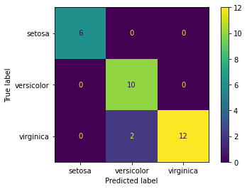

# Simple ML algorithms implementation with scikit-learn

One of the most used Python libraries for Machine Learning is [scikit-learn](https://scikit-learn.org/stable/index.html). It provides implementation a broad range of algorithm, and is relatively simple to use out-of-the-box. Let's look at an example of Logistic Regression with the classic 'iris' dataset.

```python
# Import libraries
import pandas as pd
import seaborn as sns

import sklearn
from sklearn.model_selection import train_test_split
from sklearn.linear_model import LogisticRegression
```

## Load dataset

```python
# Load sample dataset into a DataFrame
X = sns.load_dataset('iris')
X
```

<div>

<table border="1" class="dataframe">
  <thead>
    <tr style="text-align: right;">
      <th></th>
      <th>sepal_length</th>
      <th>sepal_width</th>
      <th>petal_length</th>
      <th>petal_width</th>
      <th>species</th>
    </tr>
  </thead>
  <tbody>
    <tr>
      <th>0</th>
      <td>5.1</td>
      <td>3.5</td>
      <td>1.4</td>
      <td>0.2</td>
      <td>setosa</td>
    </tr>
    <tr>
      <th>1</th>
      <td>4.9</td>
      <td>3.0</td>
      <td>1.4</td>
      <td>0.2</td>
      <td>setosa</td>
    </tr>
    <tr>
      <th>2</th>
      <td>4.7</td>
      <td>3.2</td>
      <td>1.3</td>
      <td>0.2</td>
      <td>setosa</td>
    </tr>
    <tr>
      <th>3</th>
      <td>4.6</td>
      <td>3.1</td>
      <td>1.5</td>
      <td>0.2</td>
      <td>setosa</td>
    </tr>
    <tr>
      <th>4</th>
      <td>5.0</td>
      <td>3.6</td>
      <td>1.4</td>
      <td>0.2</td>
      <td>setosa</td>
    </tr>
    <tr>
      <th>...</th>
      <td>...</td>
      <td>...</td>
      <td>...</td>
      <td>...</td>
      <td>...</td>
    </tr>
    <tr>
      <th>145</th>
      <td>6.7</td>
      <td>3.0</td>
      <td>5.2</td>
      <td>2.3</td>
      <td>virginica</td>
    </tr>
    <tr>
      <th>146</th>
      <td>6.3</td>
      <td>2.5</td>
      <td>5.0</td>
      <td>1.9</td>
      <td>virginica</td>
    </tr>
    <tr>
      <th>147</th>
      <td>6.5</td>
      <td>3.0</td>
      <td>5.2</td>
      <td>2.0</td>
      <td>virginica</td>
    </tr>
    <tr>
      <th>148</th>
      <td>6.2</td>
      <td>3.4</td>
      <td>5.4</td>
      <td>2.3</td>
      <td>virginica</td>
    </tr>
    <tr>
      <th>149</th>
      <td>5.9</td>
      <td>3.0</td>
      <td>5.1</td>
      <td>1.8</td>
      <td>virginica</td>
    </tr>
  </tbody>
</table>
<p>150 rows × 5 columns</p>
</div>

```python
# Pop the target column 'species' and store in a distinct Series
y = X.pop('species')
```

## Split into train and test sets

```python
# Use `train_test_split()` function from sklearn to extract a 20% random test set 
X_train, X_test, y_train, y_test = train_test_split(X, y, test_size=0.2)
```

## Fit model

```python
# Instantiate a logistic regression model with default parameters
model = LogisticRegression()

# Fit model on training set
model.fit(X_train, y_train)

# Predict on test set
y_pred = model.predict(X_test)
```

## Evaluate model performance

```python
# Classification report
print(sklearn.metrics.classification_report(y_test, y_pred))
```

                  precision    recall  f1-score   support
    
          setosa       1.00      1.00      1.00         6
      versicolor       0.83      1.00      0.91        10
       virginica       1.00      0.86      0.92        14
    
        accuracy                           0.93        30
       macro avg       0.94      0.95      0.94        30
    weighted avg       0.94      0.93      0.93        30
    

```python
# Plot confusion matrix
sklearn.metrics.plot_confusion_matrix(model, X_test, y_test)
```

    <sklearn.metrics._plot.confusion_matrix.ConfusionMatrixDisplay at 0x7fb3d0117510>

    

    

