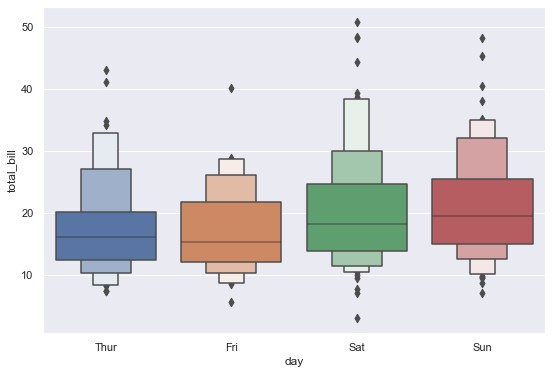

# Categorical distribution plots in Seaborn

Seaborn offers a [variety of plots](https://seaborn.pydata.org/api.html) for showing the distribution of categorical variables. Let's walk through some of them, from simplest to most detailed.

## Setup

```python
# Import libraries
import pandas as pd
import seaborn as sns

# Set plots size
sns.set(rc={'figure.figsize':(9,6)})

# Load sample data
df = sns.load_dataset('tips')
df.tail()
```

<div>

<table border="1" class="dataframe">
  <thead>
    <tr style="text-align: right;">
      <th></th>
      <th>total_bill</th>
      <th>tip</th>
      <th>sex</th>
      <th>smoker</th>
      <th>day</th>
      <th>time</th>
      <th>size</th>
    </tr>
  </thead>
  <tbody>
    <tr>
      <th>239</th>
      <td>29.03</td>
      <td>5.92</td>
      <td>Male</td>
      <td>No</td>
      <td>Sat</td>
      <td>Dinner</td>
      <td>3</td>
    </tr>
    <tr>
      <th>240</th>
      <td>27.18</td>
      <td>2.00</td>
      <td>Female</td>
      <td>Yes</td>
      <td>Sat</td>
      <td>Dinner</td>
      <td>2</td>
    </tr>
    <tr>
      <th>241</th>
      <td>22.67</td>
      <td>2.00</td>
      <td>Male</td>
      <td>Yes</td>
      <td>Sat</td>
      <td>Dinner</td>
      <td>2</td>
    </tr>
    <tr>
      <th>242</th>
      <td>17.82</td>
      <td>1.75</td>
      <td>Male</td>
      <td>No</td>
      <td>Sat</td>
      <td>Dinner</td>
      <td>2</td>
    </tr>
    <tr>
      <th>243</th>
      <td>18.78</td>
      <td>3.00</td>
      <td>Female</td>
      <td>No</td>
      <td>Thur</td>
      <td>Dinner</td>
      <td>2</td>
    </tr>
  </tbody>
</table>
</div>

## Boxplot

The classic. A number of parameters can be tuned to adjust proportions and outliers display.

```python
# Boxplot
sns.boxplot(data=df, y='total_bill', x='day',
            whis=1,                   # Whiskers extent vs IQR
            showfliers=False,         # Hide outliers markers
            width=.5,                 # Boxes width
            color='cornflowerblue',   # Avoid rainbow effect
            linewidth=1               # Line width
);
```

    

    

## Boxenplot

An "advanced" version of the boxplot, that displays a number of percentiles as small boxes, to show more detail about the distribution.

```python
# Boxenplot
sns.boxenplot(data=df, y='total_bill', x='day',
              k_depth=3   # Fixed number of percentiles to draw
);
```

    

    

## Violinplot

Violinplots combine boxplots and kernel density estimates, and are an interesting intermediary solution between simple boxplots and detailed stripplots.

```python
# Violinplot
sns.violinplot(data=df, y='total_bill', x='day', 
               hue='sex', split=True,   # Split by gender  
               cut=0,                   # Do not extend density past extreme values
               inner='box',             # Inner plot type
               bw=.35                   # "Flexibility" of kernel bandwidth
);
```

    

    

## Stripplot

Stripplots show every data point. It can be a good idea to combine them with more a simple representation like boxplots.

```python
# Boxplot + stripplot
sns.boxplot(data=df, y='total_bill', x='day', width=.5, showfliers=False, color='lightgray')
sns.stripplot(data=df, y='total_bill', x='day',
              size=4,      # Custom point radius
              jitter=.05   # Amount of jitter to avoid overlap
);
```

    

    

## Swarmplot

Swarmplot are like stripplots, but with points adjustment to avoid overlapping.

```python
# Swarmplot
sns.swarmplot(data=df, y='total_bill', x='day', hue='smoker');
```

    

    

