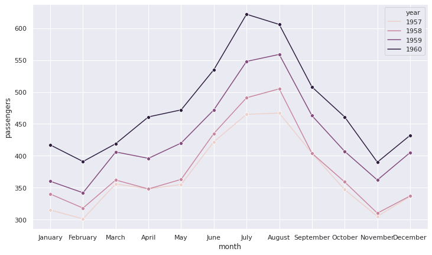
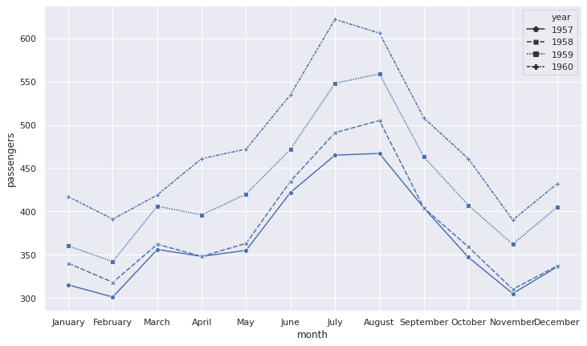
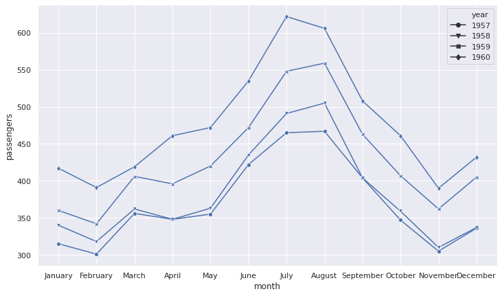

# Seaborn lineplots with markers

## Setup

```python
# Import libraries
import pandas as pd
import seaborn as sns
import numpy as np

# Set plots size
sns.set(rc={'figure.figsize':(12,7)})

# Load sample data
df = (
    sns.load_dataset('flights')
    .loc[lambda x: x['year'] > 1956]
    .reset_index(drop=True)    
)
```

## Same marker for all lines

To use the same marker style for all lines on the plot, set the `marker` argument (without a final *s*).

```python
# Line plot with the same marker for all categories
sns.lineplot(data=df, x='month', y='passengers', hue='year', marker='o');
```

    

    

## Different markers by line

To plot different markers for each line, without specifying the style, set `style` to the grouping variable and set `markers` (with a final *s*) to `True`.

```python
# Line plot with a different marker for each category
sns.lineplot(data=df, x='month', y='passengers', style='year', markers=True);
```

    

    

It is also possible to specify the [markers styles](https://matplotlib.org/3.2.1/api/markers_api.html) by passing a list. To avoid incompatibilities between the line and the markers style, set `dashes` to `False`.

```python
# Specify the markers style for each category
sns.lineplot(data=df, x='month', y='passengers', 
             style='year', dashes=False, markers=['o', 'v', 'X', 'd']);
```

    

    

