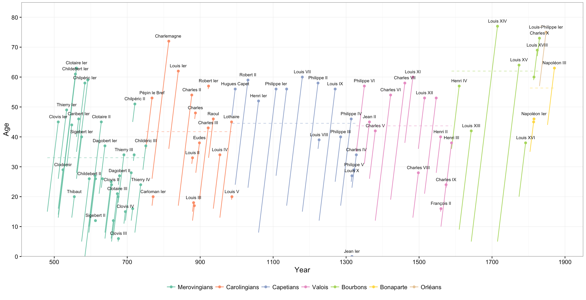
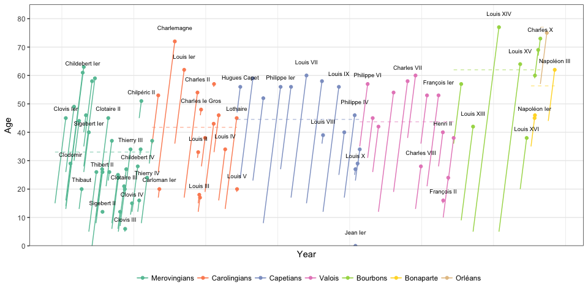

# How old did kings of France reign ?

## Project

I really liked FiveThirtyEight’s [visualization of the oldest persons](https://fivethirtyeight.com/features/why-the-oldest-person-in-the-world-keeps-dying/) in the world. It gives a very clear representation of how the age of the elderly increases over time, and how Jeanne Calment lived way longer than any other person. So I decided to reproduce the same type of graph in R to show the reigns’ length of every monarch in the history of France, that is 87 kings – no queen.

The profusion of monarchs in the early ages – the Merovingian dynasty – is partly due to the fact that the kingdom of France was divided into several parts, leading to simultaneous kings. The life expectancy increased over time, but stayed under 45 until the Bourbons. However only 4 monarchs lived longer than 70. Two kings clearly stand out by the length of their reign: Louis XIV and his great grandson Louis XV.

I scraped a [Wikipedia article](https://fr.wikipedia.org/wiki/Liste_des_monarques_de_France) as source for the data, and wrangled it to get a suitable data frame for a `ggplot2` graph.

## Results

 [](kings-france.png)

## Full Code

### Data scraping

```r
# Load libraries
library('rvest')
library('stringr')
library('tidyr')
library('ggplot2')
library('reshape2')
library('dplyr')

# Source page
page <- read_html("https://fr.wikipedia.org/wiki/Liste_des_monarques_de_France")

# Read HTML page and extract the tables
rawlist <-
    page %>%
    html_nodes("table.wikitable") %>%
    html_table(fill = TRUE) %>%
    lapply(as.data.frame) %>%
    bind_rows()
```

### Data cleaning

```r
# Remove nicknames
rawlist[, 2] <-
    rawlist[, 2] %>%
    # str_replace("\\(«.+»\\)", "") %>%
    str_replace("«.+»", "") %>%
    str_replace("\\(Charles.+Grand\\)", "") %>%
    str_replace(" «.+\\(", "(")

# Keep only relevant columns, and split columns to have the dates
rawlist <-
    rawlist %>%
    select(-c(1, 5, 6, 7)) %>%
    filter(!grepl("^(Interrègne|Nom|Durant)", Nom)) %>%
    separate("Nom", c("Nom", "Vie"), sep = "\\(") %>%
    separate("Vie", c("Naissance", "Mort"), sep = "–|-")

# Keep only the years in the dates
for (i in c(2, 3, 4, 5)) {
    rawlist[, i] <- as.numeric(str_extract(rawlist[, i], "[[:digit:]]{3,4}"))
}

# Rename columns
names(rawlist) <- c("Name", "Birth", "Death", "From", "Until")

# Add dynasties
dynasties <- c("Merovingians", "Carolingians", "Capetians", "Valois", "Bourbons", "Bonaparte", "Orléans")
rawlist[, "Dynasty"] <- dynasties[7]
rawlist[rawlist$From < 1830, "Dynasty"] <- dynasties[5]
rawlist[rawlist$From < 1589, "Dynasty"] <- dynasties[4]
rawlist[rawlist$From < 1328, "Dynasty"] <- dynasties[3]
rawlist[rawlist$From < 987, "Dynasty"] <- dynasties[2]
rawlist[rawlist$From < 751, "Dynasty"] <- dynasties[1]
rawlist[grep("Napoléon", rawlist$Name), "Dynasty"] <- dynasties[6]
rawlist$Dynasty <- factor(rawlist$Dynasty, level = dynasties)

# Other small changes to some rows
rawlist[grep("Pépin", rawlist$Name), "Name"] <- "Pépin le Bref"
rawlist[grep("Louis XVIII", rawlist$Name), "Name"][1] <- "Louis XVIII (nolabel)"
rawlist[grep("Napoléon Ier", rawlist$Name), "Name"][1] <- "Napoléon Ier (nolabel)"

# Order levels by date, for the graph
rawlist$Name <- reorder(rawlist$Name, -rawlist$Until)

# Midpoint check
head(rawlist)
```

```
##               Name Birth Death From Until      Dynasty
## 1     Clovis Ier\n   466   511  481   511 Merovingians
## 2       Clodomir\n   495   524  511   524 Merovingians
## 3    Thierry Ier\n   485   534  511   534 Merovingians
## 4    Thibert Ier\n   504   548  534   548 Merovingians
## 5        Thibaut\n   535   555  548   555 Merovingians
## 6 Childebert Ier\n   497   558  511   558 Merovingians
```

### Building graph

```r
# Melt data, and compute the age at beginning and end of reign
kingslist <-
    rawlist %>%
    select(-Death) %>%
    melt(id = c("Name", "Dynasty", "Birth"), variable.name = "Events", value.name = "Date") %>%
    mutate(Age = Date - Birth) %>%
    select(-Birth)

# Compute life expectancy per dynasty
lifeexp <-
    rawlist %>%
    mutate(DeathAge = Death - Birth) %>%
    group_by(Dynasty) %>%
    summarise(Expectancy = mean(DeathAge),
              Start = min(From),
              End = max(Until))

# Main graph
graph <-
    ggplot(data = kingslist,
           aes(x = Date,
               y = Age,
               group = Name)
           ) +
    geom_line(data = filter(kingslist, Events %in% c("From", "Until")),
              aes(group = Name, colour = Dynasty)) +
    geom_point(data = subset(kingslist, Events == "Until"),
               aes(colour = Dynasty)) +
    geom_text(data = filter(kingslist, Events == "Until", !grepl("(nolabel)", Name)),
              aes(label = Name, y = Age + 1.8),
              size = 2.5, check_overlap = TRUE) +
    labs(x = "Year", y = "Age") +
    scale_y_continuous(breaks = seq(0, 80, 10),
                       minor_breaks = NULL,
                       limits = c(0, 85),
                       expand = c(0, 0)) +
    scale_x_continuous(breaks = NULL,
                       minor_breaks = seq(500, 1900, 200),
                       limits = c(480, 1880)) +
    scale_colour_brewer(palette = "Set2") +
    theme_bw() +
    theme(legend.position = "bottom",
          legend.key = element_blank()) +
    guides(col = guide_legend(nrow = 1, title = ""))

# Add life expectancy segments
graph <-
    graph +
    geom_segment(data = lifeexp,
                 aes(x = Start, y = Expectancy,
                     xend = End, yend = Expectancy,
                     colour = Dynasty, group = Dynasty,
                     alpha = 0.3),
                 linetype = 2) +
    guides(alpha = "none")

# Plot the result
plot(graph)
```

<!-- -->
