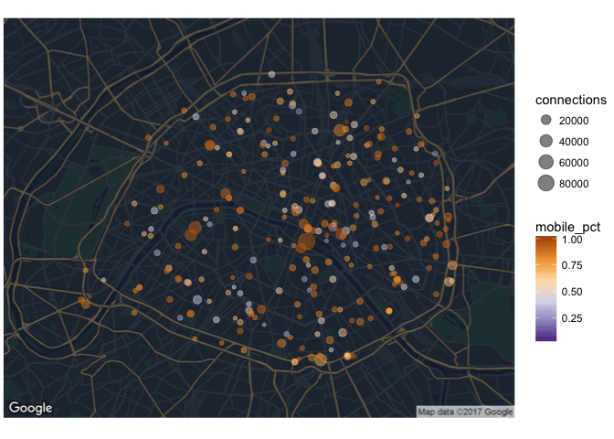

# Public Wifi in Paris: how touristic is the city ?

## Project

The city of Paris has released a dataset containing a list of all connections made in 2016 on the ~300 public wifi hotspots, available on their [open data website](https://opendata.paris.fr/explore/dataset/utilisations_mensuelles_des_hotspots_paris_wi-fi/information/). The dataset is 1.7M rows long, and features a number of interesting information for each session such as time, volume downloaded/uploaded, device, browser, OS and language. I have explored this dataset to see how much touristics Paris is, and find insights about most frequented places, top countries and languages, and preferred equipment.

## Results

Some of the key insights of the analysis include:

* The most used hotspot is at the Notre-Dame cathedral
* French is less than half of the devices language, and is not #1 in the most touristic areas.
* 67% of all connections are made through Mobile/Tablet, and more than 90% in touristic places
* Apple is by far the preferred brand in almost all countries


## Full Code

### Preparing the data

#### Setup and libraries

We will several of the standard *tidyverse* libraries for data wrangling and plotting. For the maps, we will also be using the *ggmap* package.

```r
library("tidyverse")
library("stringr")
library("lubridate")
library("ggmap")
library("knitr")
```

#### Load and format main file

```r
wifi.raw <- read_delim("./data/wifi-data-2016.csv", progress = FALSE,
                       delim = ";", na = c("NULL", ""), col_types = "ccnnnccccc")

glimpse(wifi.raw)
```

```
## Observations: 1,668,609
## Variables: 10
## $ start_time    <chr> "2016-05-27T20:38:00+02:00", "2016-05-27T20:34:0...
## $ stop_time     <chr> "2016-05-27T21:00:00+02:00", NA, "2016-05-27T21:...
## $ duration      <dbl> 1075, 302, 2525, 1164, 2102, 1050, 1570, 4501, 9...
## $ input_octets  <dbl> 3487928, 1586655, 175261111, 2443957, 4681103, 8...
## $ output_octets <dbl> 638911, 321442, 13506281, 144435, 583246, 251518...
## $ os            <chr> "Mac OS X", "Android", "iOS", "iOS", "iOS", "And...
## $ browser       <chr> "AppleMail", "Android", "Mobile Safari UIWebView...
## $ device        <chr> "Other", "Samsung GT-S5369-ORANGE/S5369BVL", "iP...
## $ langue        <chr> "fr_FR", "fr_FR", "fr_FR", "en_US", "fr_FR", NA,...
## $ site          <chr> "Centre d'Animation Espace Beaujon", "Jardin Gar...
```

```r
wifi <-
    wifi.raw %>%
    mutate(start_time = as_datetime(str_replace(start_time, "T", " ")),
           stop_time = as_datetime(str_replace(stop_time, "T", " "))) %>%
    mutate(input_mo = round(input_octets/1024^2, 2),
           output_mo = round(output_octets/1024^2, 2),
           language = str_match(langue, "([a-z]{2})?_?([A-Z]{2})?")[,2],
           country = str_match(langue, "([a-z]{2})?_?([A-Z]{2})?")[,3]) %>%
    select(-c(input_octets, output_octets)) %>%
    arrange(start_time)
```

#### Add new features

In order to improve our analysis, we can compute and add new features based on the current information we have.

First, let's simplify all OS into fewer, clean categories:

```r
# Get OS Type
wifi <-
    wifi %>%
    mutate(os_type =
           if_else(str_detect(os, "(Debian|Fedora|Mageia|MeeGo|Ubuntu|BSD)"),
                   "Linux",
                   if_else(str_detect(os, "(Windows|Mac OS|Linux|Chrome OS|Kindle|Black[Bb]erry|iOS|Android)"),
                           str_extract(os, "(Windows|Mac OS|Linux|Chrome OS|Kindle|Black[Bb]erry|iOS|Android)"),
                           "Other")
                   )
           )
```

Then, let's extract the device brand, based on the OS (for Apple), or the full device name:

```r
# Get Device Brand
wifi <-
    wifi %>%
    mutate(device_brand =
           if_else(os %in% c("iOS", "Mac OS X"), "Apple",
                   case_when(str_detect(device, "^L-EMENT") ~ "Logicom",
                             str_detect(device, "Kindle") ~ "Amazon",
                             TRUE ~ str_to_title(str_sub(str_extract(device, "^[:alpha:]{2,}[ -]"), end = -2))
                             )
                   )
           )
```

Finally, let's try to guess if the device is a Computer or a Mobile/Tablet:

```r
# Get Type of Device
wifi <-
    wifi %>%
    mutate(device_type =
           if_else(str_detect(browser, "Mobile"),
                   "Mobile/Tablet",
                   if_else(str_detect(os, "(Mobile|Phone|Bada|Symbian)"),
                           "Mobile/Tablet",
                           if_else(str_detect(os_type, "(Android|Blackberry|iOS)"),
                                   "Mobile/Tablet",
                           if_else(str_detect(os_type, "(Windows|Linux|Mac OS)"),
                                   "Computer", ""),
                           ""),
                           ""),
                   "")
           )
wifi$device_type[wifi$device_type == ""] <- NA
```

#### Join with map of hotspots

As the location of the hotspots is in a different source, we need to join it with our main dataframe. However, even after having done some cleaning on the names of the sites, there were still inconsistencies due to incorrectly spelled site names. So I had to finish the match table manually in a spreadsheet, which I import below as a csv file:

```r
# Load map of hotspots
wifi.map <- read_csv2("./data/wifi-hotspots-list.csv")
names(wifi.map) <- c("Id", "Nom", "Address", "CP", "City", "GeoPoint")

# Join, using semi-manually cleaned correspondance file
wifi.map <-
    read_csv("./data/wifi-hotspots-list-clean.csv") %>%
    left_join(wifi.map, by = c("Id" = "Id")) %>%
    select(site_key = Site.1, site_clean = Site.Clean, site_id = Id, site_xy = GeoPoint) %>%
    filter(!is.na(site_xy)) %>%
    separate(site_xy, into = c("site_geo_y", "site_geo_x"),
             sep = ", ", convert = TRUE)

# Create hotspot coordinate table, for later use
wifi.corresp <-
    wifi.map %>%
    select(site_id, site_clean, site_geo_x, site_geo_y) %>%
    rename(site = site_clean) %>%
    distinct()
```

```r
# Join main dataframe with the clean hotspot mapping
wifi <-
    wifi %>%
    left_join(wifi.map, by = c("site" = "site_key")) %>%
    select(-site) %>%
    rename(site = site_clean)
```

### Analysis

Now let's jump into the fun part. We will try to answer five questions:

1. What is the most popular hotspot ?
2. Is French the most frequent language on devices ?
3. When do people connect the most ?
4. What is the proportion of mobile vs computers ?
5. What is the most popular device brand ?

#### Most popular hotspots

Let's take a first look at the most used hotspots, in terms of number of connections and output volume (in Mo).

```r
graph.popular <-
    wifi %>%
    filter(!is.na(site_id)) %>%
    group_by(site_id, site) %>%
    summarise(connections = n(),
              avg_volume = sum(output_mo) / connections) %>%
    arrange(desc(connections)) %>%
    left_join(wifi.corresp) %>%
    ungroup()

graph.popular %>%
    select(site, connections, avg_volume) %>%
    head(10) %>%
    kable(col.names = c("Site", "Connections", "Average Volume (Mo)"),
          digits = 2, row.names = TRUE)
```

|   |Site                                         | Connections| Average Volume (Mo)|
|:--|:--------------------------------------------|-----------:|-------------------:|
|1  |Square Jean XXIII                            |       91691|                3.85|
|2  |Centre d'Accueil Kellermann                  |       45496|                7.04|
|3  |Berges de Seine Rive Gauche - Gros Caillou   |       40797|                2.88|
|4  |Jardin d'Eole 1                              |       38778|                5.72|
|5  |Bibliothèque Historique de la Ville de Paris |       33443|                5.17|
|6  |Parc Champs de Mars                          |       32459|                3.55|
|7  |Bibliothèque Yourcenar                       |       32134|                4.49|
|8  |Square Louis XIII                            |       30718|                2.60|
|9  |Médiathèque Marguerite Duras                 |       27730|                4.16|
|10 |Parc Monceau 1 (Entrée)                      |       23743|                3.60|

The most popular hotspot by far is the square just behind the Notre-Dame cathedral, which is a very touristic area, so this result does not come as a surprise. Hotspots 3, 6 and 8 are also places with high tourist frequentation. Compared to the other hotspots, the average output volume per session is lower, which makes sense as the latter are probably more used for work.

We can plot a map of all hotspots and their number of connections. I customized the Google Map style using the [dedicated tool](https://mapstyle.withgoogle.com/).

```r
# Define a map style and save it for later
googlemap.style <- "style=element:geometry%7Ccolor:0x242f3e&style=element:labels%7Cvisibility:off&style=feature:administrative.land_parcel%7Cvisibility:off&style=feature:administrative.neighborhood%7Cvisibility:off&style=feature:poi.park%7Celement:geometry%7Ccolor:0x263c3f&style=feature:road%7Celement:geometry%7Ccolor:0x38414e&style=feature:road%7Celement:geometry.stroke%7Ccolor:0x212a37&style=feature:road.highway%7Celement:geometry%7Ccolor:0x746855&style=feature:road.highway%7Celement:geometry.stroke%7Ccolor:0x1f2835&style=feature:transit%7Celement:geometry%7Ccolor:0x2f3948&style=feature:water%7Celement:geometry%7Ccolor:0x17263c"

googlemap.graph <-
    get_googlemap(center = c(lon = 2.33, lat = 48.86), zoom = 12,
                  size = c(640, 500), scale = 2, maptype = "roadmap",
                  style = googlemap.style)
```

```r
# Plot hotspots by volume
ggmap(googlemap.graph) + theme_void() +
      geom_point(data = graph.popular, colour = "yellow",
                 aes(x = site_geo_x, y = site_geo_y, size = connections,
                     alpha = avg_volume))
```

<!-- -->

#### Top languages

Let's know look at the most popular languages based on the device information:

```r
# Top 10 languages
graph.languages <-
    wifi %>%
    group_by(language) %>%
    summarise(percent = n() / nrow(wifi) * 100) %>%
    arrange(desc(percent)) %>%
    filter(!is.na(language)) %>%
    top_n(10)
```

```r
ggplot(graph.languages, aes(reorder(language, percent), percent)) +
    geom_col() +
    geom_text(aes(label = paste(round(percent, 1), "%")),
              nudge_y = 0.5, hjust = "left") +
    coord_flip() +
    theme(panel.grid = element_blank()) +
    ylim(0, 50) +
    labs(y = "Share %", x = "Device Language")
```

<!-- -->

French represents less than half of the sessions on public wifi, followed by English. As UK and US citizens are the 2nd and 3rd among foreign visitors in Paris, this is consistent. Spanish and Germans are also within the top 5 nationalities visiting Paris.

We can now plot a map showing the most used language by hotspot. While most are French, a number of very touristic areas have more English devices. There is also one hotspot where the most frequent language is Arabic.

```r
graph.language <-
    wifi %>%
    filter(!is.na(site_id)) %>%
    group_by(site_id, language) %>%
    summarise(connections = n()) %>%
    ungroup() %>%
    group_by(site_id) %>%
    mutate(lang_pct = round(connections / sum(connections), 4),
           total_count = sum(connections)) %>%
    arrange(site_id, desc(connections)) %>%
    filter(!is.na(language)) %>%
    top_n(n = 1, wt = lang_pct) %>%
    left_join(wifi.corresp)
```

```r
ggmap(googlemap.graph) + theme_void() +
    geom_point(data = graph.language,
               aes(x = site_geo_x, y = site_geo_y, size = connections,
                   colour = language, alpha = lang_pct))
```

<!-- -->

If we zoom in on locations where French is not the most frequent language, we can confirm our assumption about highly touristic areas:

```r
graph.language %>%
    ungroup() %>%
    filter(language != "fr", total_count > 5000) %>%
    arrange(desc(total_count)) %>%
    transmute(site, language, lang_pct * 100, total_count) %>%
    kable(col.names = c("Site", "Language #1", "Share %", "Connections"),
          row.names = TRUE)
```

|   |Site                                       |Language #1 | Share %| Connections|
|:--|:------------------------------------------|:-----------|-------:|-----------:|
|1  |Square Jean XXIII                          |en          |   39.12|       91691|
|2  |Berges de Seine Rive Gauche - Gros Caillou |en          |   29.69|       40797|
|3  |Jardin d'Eole 1                            |ar          |   38.64|       38778|
|4  |Parc Champs de Mars                        |en          |   34.79|       32459|
|5  |Square Louis XIII                          |en          |   30.85|       30718|
|6  |Square Rene Viviani                        |en          |   42.92|       19583|
|7  |Musee du Petit Palais                      |en          |   37.09|       18692|
|8  |Parvis de L'Hôtel de Ville (Seine)         |en          |   30.88|       10203|
|9  |Jardin d'Eole 2                            |en          |   42.00|        8276|
|10 |Berges de Seine Rive Gauche - Solferino    |en          |   37.69|        6286|

#### Connections per day

We can start by looking at patterns in connections through the whole year, with a grid plot by day.

```r
graph.dayofyear <-
    wifi %>%
    mutate(day = day(start_time),
           month = month(start_time)) %>%
    group_by(month, day) %>%
    summarise(connections = n())
```

```r
ggplot(graph.dayofyear, aes(factor(day), reorder(month, -month))) +
    geom_raster(aes(fill = connections)) +
    scale_fill_distiller(palette = "Blues", direction = 1) +
    labs(x = "Day of month", y = "Month")
```

<!-- -->

It appears that there is a problem in the data: no connections have been recorded for the first 3 days of April through December, while there is are much more connections on 4-12 Janury to March. There is obviously a mixup in the dates, months and days have probably been inverted for the first 3 days of each month.

Given that the date-times are not reliable in this dataset, I will not go further in the analysis by day and hour.

#### Mobile vs Computer

On average, 67% of all connections are made on Mobile/Tablet.
But where do people use mobiles/tablets and computers the most ?

```r
graph.device_type <-
    wifi %>%
    filter(!is.na(site_id)) %>%
    group_by(site_id, device_type) %>%
    summarise(connections = n()) %>%
    mutate(mobile_pct = connections / sum(connections)) %>%
    filter(device_type == "Mobile/Tablet") %>%
    left_join(wifi.corresp) %>%
    ungroup()
```

```r
table.device_type <-
    graph.device_type %>%
    select(site, connections, mobile_pct) %>%
    mutate(mobile_pct = round(mobile_pct * 100, 1)) %>%
    filter(connections > 5000) %>%
    arrange(mobile_pct)

rbind(head(table.device_type, 5), c("...", "...", "..."), tail(table.device_type, 5)) %>%
    kable(col.names = c("Site", "Connections", "Mobile Share %"))
```

|Site                                         |Connections |Mobile Share % |
|:--------------------------------------------|:-----------|:--------------|
|Bibliothèque Historique de la Ville de Paris |6978        |20.9           |
|Médiathèque Marguerite Duras                 |9421        |34             |
|Bibliothèque Yourcenar                       |12378       |38.5           |
|Maison Initiatives Etudiantes                |7760        |40.2           |
|Bibliothèque Trocadero                       |5128        |41.1           |
|...                                          |...         |...            |
|Berges de Seine Rive Gauche - Solferino      |5889        |93.7           |
|Parc Champs de Mars                          |30468       |93.9           |
|Square Louis XIII                            |28964       |94.3           |
|Square Jean XXIII                            |86610       |94.5           |
|Parvis de L'Hôtel de Ville (9_place)         |5309        |94.6           |

Unsurprinsingly, libraries and other studying places have the highest computer usage, while touristic areas have almost exclusive mobile usage.

Let's recap this on a map, with a color indicating if the hotspot is used more by Mobiles or Computers.

```r
ggmap(googlemap.graph) + theme_void() +
      geom_point(data = graph.device_type,
                 aes(x = site_geo_x, y = site_geo_y, size = connections,
                     colour = mobile_pct), alpha = 0.5) +
      scale_colour_distiller(type = "div", palette = 4)
```

<!-- -->

#### Preferred brands

Note that about 27% of connections do not have a country indication from the device, and that we have identified only 67% of devices brands. However, this still leaves us with 1.1M connections to analyse.

```r
wifi %>%
    group_by(device_brand, device_type) %>%
    summarise(percent = (n() / nrow(wifi)) * 100) %>%
    arrange(desc(percent)) %>%
    filter(!is.na(device_brand) & !is.na(device_type)) %>%
    head(10) %>%
    kable(digits = 1, col.names = c("Brand", "Device Type", "Share %"))
```

|Brand     |Device Type   | Share %|
|:---------|:-------------|-------:|
|Apple     |Mobile/Tablet |    28.7|
|Samsung   |Mobile/Tablet |    17.3|
|Apple     |Computer      |     9.3|
|Lg        |Mobile/Tablet |     1.2|
|Lumia     |Mobile/Tablet |     1.1|
|Htc       |Mobile/Tablet |     0.9|
|Generic   |Mobile/Tablet |     0.8|
|Huawei    |Mobile/Tablet |     0.8|
|Microsoft |Mobile/Tablet |     0.6|
|Asus      |Mobile/Tablet |     0.5|

Apple is clearly leading with 38% overall share of devices on mobile and computers, followed by Samsung. All other brands are below 2%.

Are there significant differences depending on the country ? We can look at the top brands on the 10 most frequent country, and see that Apple and Samsung are consistently the first 2 brands (except for Apple on Arab Emirates devices, for some reason that I couldn't explain otherwise than data corruption), while the 3rd brand has higher variability but a much smaller share of market.

```r
wifi %>%
    group_by(country, device_brand) %>%
    summarise(count = n()) %>%
    filter(!is.na(device_brand), !is.na(country)) %>%
    ungroup() %>%
    group_by(country) %>%
    mutate(country_total = sum(count),
           percent = count / country_total * 100) %>%
    arrange(desc(country_total), desc(percent)) %>%
    top_n(3) %>%
    mutate(rank = row_number(-percent),
           device_brand = paste(device_brand, "-", round(percent, 1), "%")) %>%
    head(30) %>%
    select(country, country_total, device_brand, rank) %>%
    spread(rank, device_brand) %>%
    arrange(desc(country_total)) %>%
    select(-country_total) %>%
    kable(col.names = c("Country", "Brand #1", "Brand #2", "Brand #3"))
```

|Country |Brand #1         |Brand #2          |Brand #3        |
|:-------|:----------------|:-----------------|:---------------|
|FR      |Apple - 59.4 %   |Samsung - 25.7 %  |Lumia - 1.9 %   |
|US      |Apple - 74.9 %   |Samsung - 15.1 %  |Nexus - 1.5 %   |
|GB      |Apple - 43.7 %   |Samsung - 38.6 %  |Lg - 2.4 %      |
|ES      |Apple - 57.4 %   |Samsung - 22.9 %  |Aquaris - 4.3 % |
|IT      |Apple - 52.4 %   |Samsung - 24.8 %  |Lumia - 4.1 %   |
|DE      |Apple - 55.9 %   |Samsung - 26.9 %  |Htc - 4 %       |
|BR      |Apple - 67.2 %   |Samsung - 22.9 %  |Lg - 3.4 %      |
|CA      |Apple - 71 %     |Samsung - 17 %    |Lg - 4.1 %      |
|CN      |Apple - 79.3 %   |Samsung - 6.9 %   |Huawei - 4.3 %  |
|AE      |Samsung - 99.3 % |Microsoft - 0.4 % |Lumia - 0.2 %   |
