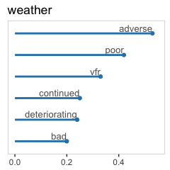

# Exploring the main causes of aircrafts crashes since 1908

## Project

Kaggle published a [dataset](https://www.kaggle.com/saurograndi/airplane-crashes-since-1908) collecting the full history of airplane crashes throughout the world from 1908 to present, i.e. more than 5200 crashes leading to 100K+ deaths. I conducted a text analysis on the description lines of this dataset, in order to extract the most common causes of planes crashes. 

## Results

The analysis suggested that the main causes of crashes are: pilot, engine failure and weather. We also found some context indicating that the approach/landing phases are the most dangerous. These results actually concur with the official analysis of the most frequent [causes of crashes](http://www.planecrashinfo.com/cause.htm).

## Full Code

### 1. Data loading and preparation

```r
# Load libraries
library("tm")
library("dplyr")
library("stringr")
library("tidyr")
library("factoextra")
library("ggplot2")
```

We begin by loading the file and extract the text from the Summary column, and perform some initial basic formatting:

```r
### Read file
raw <- read.csv("./data/airplanes_crashes_1908.txt", stringsAsFactors = FALSE)

### Some initial formatting and cleaning
crashes <-
    raw %>%
    mutate(Date = as.Date(Date, format = "%m/%d/%Y")) %>%
    rename(Flight = `Flight..`)

### Load text as corpus
rawtxt <- VCorpus(VectorSource(crashes$Summary))
```

We do some cleaning on the text, and then create a first Document-Term Matrix, from which we remove the most generic terms like 'aircraft' or 'crash', that would not add any value to the analysis of the causes:  


```r
### Cleaning
rawtxt <- tm_map(rawtxt, removePunctuation)
rawtxt <- tm_map(rawtxt, content_transformer(tolower))
rawtxt <- tm_map(rawtxt, removeWords, stopwords("english"))
rawtxt <- tm_map(rawtxt, stripWhitespace)

### Create document-terms matrix, removing generic terms
dtm <- DocumentTermMatrix(rawtxt, control = list(stopwords = c("aircraft", "plane", "crashed", "crash", "flight", "flew", "killed", "due", "resulted", "cause", "caused", "one", "two")))
print(dtm)
```

```
## <<DocumentTermMatrix (documents: 5268, terms: 9852)>>
## Non-/sparse entries: 75186/51825150
## Sparsity           : 100%
## Maximal term length: 32
## Weighting          : term frequency (tf)
```

As the full Document-Term Matrix is very sparse, we strongly reduce it by removing the sparser terms, decreasing its size from almost 10000 to only the 61 most frequent terms.


```r
### Remove sparse terms from DTM
dtms <- removeSparseTerms(dtm, 0.97)
print(dtms)
```

```
## <<DocumentTermMatrix (documents: 5268, terms: 61)>>
## Non-/sparse entries: 21516/299832
## Sparsity           : 93%
## Maximal term length: 10
## Weighting          : term frequency (tf)
```

### 2. Find clusters of words

To find frequently associated words, we first compute a distance matrix based on our reduced Document-Term Matrix, then apply K-means clustering. 


```r
### Compute distance matrix
d <- dist(t(dtms), method = "euclidian")

### Compute K-means
km <- kmeans(d, 16, iter.max = 50, nstart = 10)
```

We can first print the groups generated by the clustering:


```r
### Display results as a list
grouplist = function(input) {
    output <- list()
    for (i in 1:max(input)) {
        output[[i]] <- names(input[input == i]) 
    }
    for (i in output) {
        cat(i, "\n", sep = ", ")
    }
}

grouplist(km$cluster)
```

```
## accident, pilots, terrain, 
## failure, 
## takeoff, 
## emergency, failed, loss, lost, power, shortly, wing, 
## air, feet, miles, poor, route, 
## approach, runway, 
## cargo, control, ground, left, right, struck, taking, 
## pilot, 
## airport, fire, fuel, 
## crew, landing, 
## attempting, land, 
## conditions, weather, 
## altitude, mountain, 
## continued, flames, heavy, hit, maintain, rain, sea, stalled, turn, vfr, visibility, 
## area, descent, error, flying, fog, high, improper, low, minutes, short, trees, 
## engine,
```

This is a bit raw, so we can go further than just printing the list of clusters, by plotting the clusters using the *factoextra* package. The axes will show us how far clusters are from each others:


```r
fviz_cluster(km, data = d, geom = "text", show.clust.cent = FALSE, 
             repel = TRUE, labelsize = 10) +
    theme(legend.position = "none") +
    labs(title = "", x = "", y = "")
```

<!-- -->

With this first part of the analysis, we can spot a few groups of words that are likely causes or situations of the crashes:   

* Pilot    
* Engine   
* Weather conditions, and notably poor visibility  
* Incorrect altitude  
* Approach of the airport/runway

### 3. Association with most frequent terms

To complete this first semantic analysis, we can look at the most frequent terms, and their correlation with other terms.

We begin by plotting the 20 most frequent terms. All of them are obviously included in the above cluster analysis, but here we get a sense of their frequency relatively to each others. 


```r
### Order terms by frequency
freq <- colSums(as.matrix(dtm))
freq <- 
    freq %>%
    data.frame(term = names(freq), frequency = freq) %>%
    select(term, frequency) %>%
    arrange(desc(frequency)) 

### Plot most frequent terms
ggplot(freq[1:20, ], aes(x = frequency, y = reorder(term, frequency))) + 
    geom_point(colour = "#2b83ba") + 
    geom_segment(aes(xend = 0, yend = term), size = 1, colour = "#2b83ba") +
    geom_text(aes(label = term, vjust = "middle", hjust = "left"), nudge_x = 10, size = 3.5) +
    theme(panel.background = element_rect(fill = "white"),
          panel.grid.major.x = element_line(colour = "#f7f7f7"),
          panel.grid.major.y = element_blank(),
          panel.grid.minor = element_blank(), 
          axis.text.y = element_blank(), 
          axis.title = element_blank(), 
          axis.ticks.y = element_blank()) +
    xlim(0, 1100) +
    labs(title = "Occurences of top 20 most frequent terms")
```

<!-- -->

Some hypothesis we can do on the top 5 terms:

* __Pilot__: is it only because this is a generic term, or indicating that pilot is the cause ?  
* __Approach__: this suggest that accidents often happen in the runway approach phase  
* __Engine__: probably one of the most common causes  
* __Runway__: relates to the approach phase  
* __Failure__: this is too generic to draw conclusions, we'll need some more context  

To add more context to the list, we have to look at which terms are most correlated with these 20 frequent terms. For each of them, let's plot the top 5 terms that have a correlation higher than 0.17.


```r
### Terms correlation
assocs <- findAssocs(dtm, as.character(freq[1:20, 1]), corlimit = 0.17)
```


```r
### Nice display of the results
df <- data.frame(term1 = character(), 
                 term2 = character(), 
                 freq = numeric())

for (j in names(assocs)) {
    df <- rbind(df,
                data.frame(term1 = rep(j, length(assocs[[j]])),
                     term2 = names(assocs[[j]]), 
                     freq = assocs[[j]], 
                     row.names = NULL, stringsAsFactors = FALSE))
}

for (i in unique(df$term1)) {
    graph <- ggplot(head(df[df$term1 == i, ], 7), aes(x = freq, y = reorder(term2, freq))) + 
        geom_point(colour = "#2b83ba") + 
        geom_text(aes(label = term2, vjust = "bottom", hjust = "right"), nudge_y = 0.1, colour = "#636363", size = 3.5) +
        geom_segment(aes(xend = 0, yend = term2), size = 1, colour = "#2b83ba") +
        theme(panel.background = element_rect(fill = "white", colour = "#cccccc"),
              panel.grid = element_blank(), 
              axis.title = element_blank(), 
              axis.text.y = element_blank(), 
              axis.ticks.y = element_blank()) +
        xlim(0, 0.55) +
        labs(title = i)
    plot(graph)
}
```

<!-- --><!-- --><!-- --><!-- --><!-- --><!-- --><!-- --><!-- --><!-- --><!-- --><!-- --><!-- --><!-- --><!-- --><!-- --><!-- --><!-- --><!-- -->

This gives us more context. Let's look at some of the terms associations:  

* __Pilot__: 'error' is one of the most correlated words, which is consistent with the fact that 60% of crashes are due to pilot errors   
* __Approach__: the accidents in final approach phase seem to be often caused by confusion in reading instruments and low visibility ('ils', 'instruments', 'visual', 'missed')   
* __Engine__ seems related to shutdown of engine and/or loss of power  
* __Runway__ is associated with 'short', 'end' and 'overran', that could be as well in takeoff or landing phases  
* __Failure__: we have more context here, suggesting that it can be pilot, maintainance, procedure or system failures  
* __Landing__: this shows that it is not necessarily about the standard landing phase, but rather about landing gears, or emergency landings   
* __Weather__ and __Conditions__ suggest that _visibility_ is one of the most important crashes factors in bad weather
