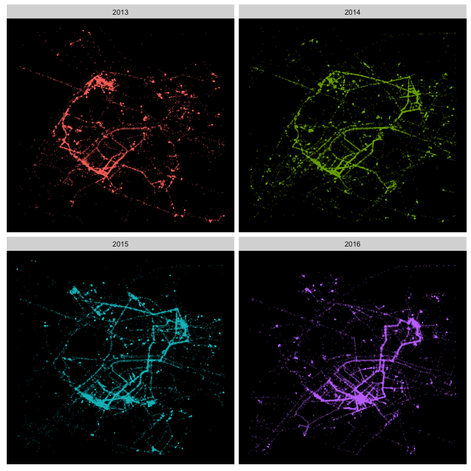
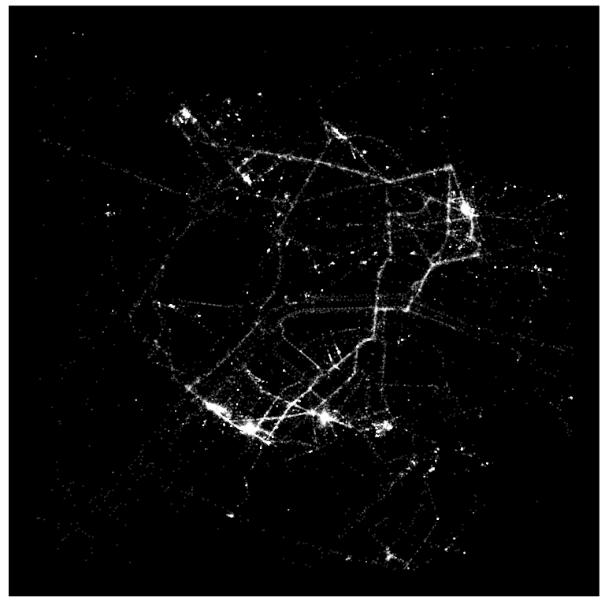
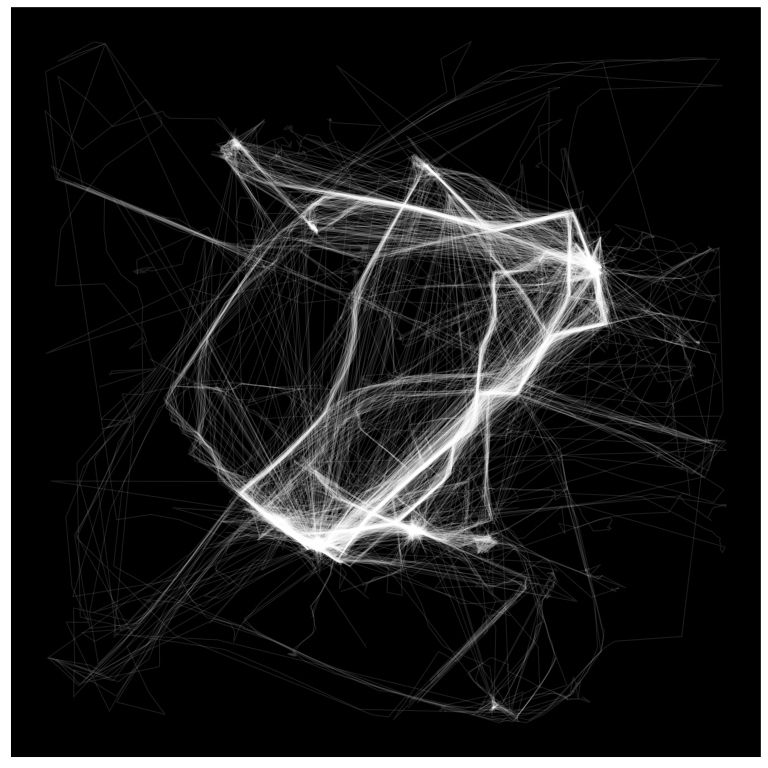

# Visualising four years of my Google location history

## Project

Since 2013, I have carefully kept my Google [location history](https://www.google.com/maps/timeline), fascinated by the fact that I could, in ten or twenty years from now, retrace every move I made in a day, be it a normal work day, or a trip in Italy. Nathan Yau from Flowingdata.com has made a [tutorial](http://flowingdata.com/2014/01/28/how-to-map-geographic-paths-in-r/) on how to plot location points with R, which gave me the idea of plotting my own location history for 4 years.

## Results



## Full Code

### Load and format data

The first step is to download your file with [Google Takeout](https://takeout.google.com/settings/takeout). You have the choice between JSON and KML, and I chose JSON, which I’m more familiar to work with.

```r
### Load libraries
library("jsonlite")
library("dplyr")
library("ggplot2")
library("lubridate")
```

```r
### Load JSON data
raw <- fromJSON("location-history.json")
```

The importation of the JSON files is straightforward with the *jsonlite* package, although it can take several minutes if you upload several years of location history. The imported data is a list that includes a great number of nested dataframes in the `activities` column, which we drop as it won't be needed. We actually end up with a very simple dataframe with only 4 columns: `time`, `year` (computed from the timestamp), `latitude` and `longitude`. In addition, we can filter the data on a delimited area of latitude and longitude, to focus the map on a specific zone -- Paris in this example.

```r
### Clean and format data
routes <-
    raw[[1]][1:4] %>%
    transmute(time = as.POSIXct(as.numeric(timestampMs) / 1000, origin = "1970-01-01"),
              year = year(time),
              latitude = latitudeE7 / 1e+07,
              longitude = longitudeE7 / 1e+07) %>%
    filter(year >= 2013, year <= 2016)

### Filter on Paris area
zone <- c(48.825, 48.903, 2.250, 2.350)
routes <-
    routes %>%
    filter(latitude >= zone[1] & latitude <= zone[2],
           longitude >= zone[3] & longitude <= zone[4])
```

### Plots

After having tried a number of plot styles, including with maps of Paris, I finally decided that a simple black background lead to the most impactful effect.

```r
### Plot: define theme
theme_map <-
    theme(panel.background = element_rect(fill = "black", colour = "black"),
    panel.grid.major = element_blank(), panel.grid.minor = element_blank(),
    axis.text.x = element_blank(), axis.text.y = element_blank(),
    axis.title.x = element_blank(), axis.title.y = element_blank(),
    axis.ticks = element_blank(), legend.position = "none")
```

### Single year in points

This first map is the most basic, with a single year plotted, and each location datapoint plotted as a white dot with 80% transparency. As a results, the most frequented areas stand out: home, office, and home-office journey.

```r
### Plot points only, for a specific year
ggplot(data = filter(routes, year == 2015),
           aes(x = longitude,
               y = latitude)) +
    geom_point(alpha = 0.2, size = 0.4, shape = 16, colour = "white") +
    theme_map
```

<!-- -->

#### Facets with each year

We can also plot several years in a facet, with a different color for each year. You can see clearly different paths every year, as my home, office, and client’s office have changed between 2013 and 2016.

```r
### Plot points by year
ggplot(data = routes,
           aes(x = longitude,
               y = latitude,
               colour = as.factor(year))) +
    geom_point(alpha = 0.2, size = 0.4, shape = 16) +
    theme_map +
    facet_wrap( ~ year)
```

<!-- -->

#### Adding lines

Finally, the most beautiful effect in my opinon is achieved by drawing lines between each datapoint.

```r
### Plot lines only, for a specific year
ggplot(data = filter(routes, year == 2015),
           aes(x = longitude,
               y = latitude)) +
    geom_path(alpha = 0.1, size = 0.4, colour = "white") +
    theme_map
```

<!-- -->

